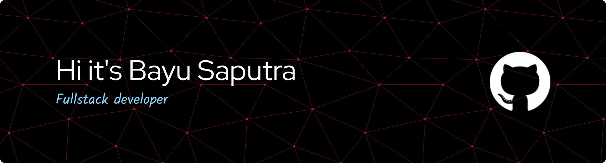

# About Me:
🔭 I’m currently studying at a vocational high school.   🕮 I’m currently learning Linux, full-stack development, and AI/ML.   🎌 My dream is to study in Japan

## 🌐 Connect with me

## 💻 Tech Stack
<!-- Language -->

<!-- Tools -->

<!-- OS -->

<!-- Terminal -->

## 📊 My Github Stats:
 

## Contribution

###
